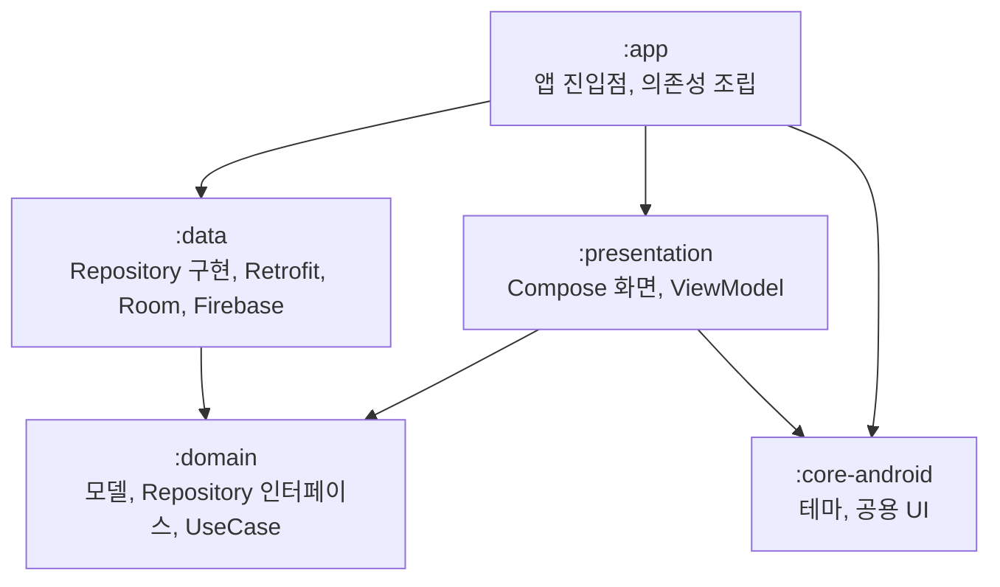

# 더 무비 (The Movie)

영화 정보를 확인하고, 관람한 영화의 감상문을 사진과 함께 기록하며, 가까운 영화관을 찾을 수 있는 안드로이드 앱입니다.

2022년에 XML 기반으로 개발한 앱을 클린 아키텍처와 Jetpack Compose, MVI 구조로 리팩터링했습니다.

▶️ [시연 영상 (YouTube)](https://youtube.com/shorts/mQ-i2It5WsY)

  


## 개발 기간

- 최초 개발: 2022.09 ~ 2022.12 (XML, MVVM)
- 리팩터링: 2026.09 ~ 2026.10 (Jetpack Compose, 클린 아키텍처, MVI)

  


## 주요 기능


| 기능     | 내용                                    |
| ------ | ------------------------------------- |
| 🔐 인증  | 회원가입, 로그인, 로그아웃                       |
| 🎬 영화  | 인기 영화, 높은 평점 영화, 영화 검색, 상세 정보와 예고편 재생 |
| 🖊 감상문 | 사진을 포함한 감상문 작성, 수정, 삭제, 계정별 서버 백업     |
| 📍 영화관 | 현재 위치 주변 영화관 지도 표시, 카카오맵 길찾기 연동       |
| 🔔 알림  | 푸시 알림 수신                              |


  


## 기술 스택


| 분류           | 사용 기술                                                       |
| ------------ | ----------------------------------------------------------- |
| Language     | Kotlin                                                      |
| UI           | Jetpack Compose, Material3, Navigation Compose              |
| Architecture | 클린 아키텍처, MVI, 멀티모듈                                          |
| DI           | Hilt                                                        |
| Async        | Coroutines, Flow                                            |
| Network      | Retrofit, OkHttp, kotlinx.serialization                     |
| Local        | Room, DataStore                                             |
| Image        | Coil                                                        |
| Media        | android-youtube-player                                      |
| Location     | Play Services Location (FusedLocationProvider)              |
| Firebase     | Authentication, Realtime Database, Storage, Cloud Messaging |
| 외부 API / SDK | TMDB API, Kakao Local API, Kakao Map SDK                    |
| Build        | Version Catalog, Convention Plugin                          |
| Quality      | ktlint, detekt, Android Lint, JUnit, GitHub Actions         |


  


## 아키텍처

클린 아키텍처를 바탕으로 Presentation, Domain, Data 계층을 각각 모듈로 분리했습니다.




- `:domain`은 Android에 의존하지 않는 순수 Kotlin 모듈이며, `:presentation`과 `:data`는 모두 `:domain`에 의존합니다.
- `:presentation`은 `:data`에 의존하지 않으므로, 화면 코드에서 Retrofit, Room, Firebase를 직접 참조할 수 없습니다.
- 화면은 MVI 패턴을 따르며, 화면마다 `Contract`에 `UiState`, `Intent`, `Effect`를 정의합니다.
  - 화면은 사용자 입력을 `Intent`로 ViewModel에 전달하고, ViewModel은 상태를 갱신해 `StateFlow`로 화면에 내려보냅니다.
  - 토스트나 화면 이동처럼 한 번만 처리해야 하는 이벤트는 `Effect`로 분리해 `Channel`로 전달합니다. 화면은 `repeatOnLifecycle(STARTED)` 안에서 `Effect`를 수집하므로, 앱이 백그라운드에 있는 동안 발생한 이벤트도 `Channel` 버퍼에 보관됐다가 화면이 다시 보일 때 처리됩니다.

  


## 리팩터링 (Before → After)

기존 코드 분석과 설계는 직접 하고, 구현과 테스트 작성은 Claude Code와 Cursor로 진행했습니다. AI가 프로젝트 규칙에 맞게 코드를 만들도록 `CLAUDE.md`와 `.cursor/rules`에 규칙을 정의하고, 커밋·PR 메시지 작성은 스킬로 표준화했습니다. 결과는 직접 리뷰하고 PR마다 CI(Lint, ktlint, detekt, 단위 테스트, 빌드)로 검증했습니다.


| 항목     | Before                                                                 | After                                                           |
| ------ | ---------------------------------------------------------------------- | --------------------------------------------------------------- |
| UI     | XML, 화면별 Activity + Fragment                                           | Jetpack Compose, 단일 Activity                                    |
| 아키텍처   | MVVM                                                                   | 클린 아키텍처, MVI                                                    |
| 상태 전달  | LiveData                                                               | StateFlow, Channel                                              |
| 모듈     | 단일 모듈                                                                  | 멀티 모듈 (`app`, `presentation`, `domain`, `data`, `core-android`) |
| DI     | 없음                                                                     | Hilt                                                            |
| 데이터 접근 | Repository는 Room만 감싸고, Firebase와 Retrofit은 Activity와 ViewModel에서 직접 호출 | Repository 인터페이스와 구현 분리                                         |
| 오류 처리  | 일부만 처리, 원인 구분 없음                                                       | 결과 타입으로 원인별 안내                                                  |
| API 키  | 소스 코드(`Credentials`)에 직접 입력                                            | `local.properties`로 분리                                          |
| 지도     | Google Maps, TMAP                                                      | Kakao Map SDK, Kakao Local API                                  |
| 품질 검사  | 없음                                                                     | PR마다 Lint, ktlint, detekt, 단위 테스트, 빌드 실행                        |
| 테스트    | 없음                                                                     | 단위 테스트 약 200개                                                   |


  


## 기술적 고민과 문제 해결


### 1. 재설치 후 새 감상문이 서버의 기존 감상문을 덮어쓰는 문제

**문제**
앱을 재설치한 뒤 서버의 감상문을 불러오기 전에 새 감상문을 저장하면, 새 감상문이 서버에 있던 기존 감상문을 덮어써 기존 감상문이 사라지는 문제가 있었습니다.

**원인**
감상문은 Room에 먼저 저장한 뒤 Firebase Realtime Database에 백업합니다. 이때 Room의 자동 증가 id를 서버 키로 그대로 사용했는데, 이 id는 기기마다 1부터 다시 매겨집니다. 그래서 재설치 직후 작성한 감상문이 id 1을 받아 서버의 `users/{uid}/reviews/1`에 저장되면서, 같은 키에 있던 기존 감상문을 덮어썼습니다.

**해결**

- Room 자동 증가 id 대신 Firebase `push().key`로 감상문 id를 생성하고, 이 id를 Room 기본 키와 서버 키로 함께 사용했습니다.
- push 키는 생성 시각(밀리초)과 무작위 값을 조합해 기기에서 만들어지므로, 오프라인에서도 생성할 수 있고 다른 기기에서 만든 키와 겹칠 가능성이 사실상 없습니다.
- 서버 데이터 소스를 가짜 객체로 바꾼 단위 테스트에서 재설치 직후 상황을 재현해, 새 감상문이 기존 감상문의 키를 쓰지 않는지 검증했습니다.


### 2. 네트워크 오류 구분과 일시적 오류 재시도

**문제**
기존 코드는 Retrofit 요청의 예외를 처리하지 않아 요청이 실패하면 앱이 종료됐습니다. 또한 시간 초과, 인터넷 연결 문제, 서버 오류를 구분하지 않아 원인에 맞는 안내를 할 수 없었고, 서버가 503(Service Unavailable, 일시적인 서비스 불가) 응답을 한 번만 보내도 재시도 없이 해당 요청이 곧바로 실패했습니다.

**해결 ①** `SafeApiCall`**로 오류 종류 구분**

```kotlin
internal suspend fun <T> safeApiCall(block: suspend () -> T): DataResult<T> =
    try {
        Outcome.Success(block())
    } catch (e: CancellationException) {
        throw e
    } catch (_: SocketTimeoutException) {
        Outcome.Failure(RemoteError.Timeout)
    } catch (_: IOException) {
        Outcome.Failure(RemoteError.Network)
    } catch (e: HttpException) {
        Outcome.Failure(RemoteError.Http(e.code()))
    } ...
```

- 예외를 `Timeout`, `Network`, `Http(code)` 등으로 구분해 결과 타입으로 반환합니다. 화면은 이 오류를 `remoteErrorMessage`로 "네트워크에 연결되지 않았습니다.", "응답 시간이 초과되었습니다." 같은 안내로 바꿔 보여 주고, 목록을 불러오지 못하면 다시 시도 버튼을 함께 보여 줍니다.
- `CancellationException`은 실패로 바꾸지 않고 다시 던집니다. 실패로 바꾸면 화면을 벗어나 코루틴이 취소된 뒤에도 이후 코드가 계속 실행되기 때문입니다.

**해결 ②** `RetryInterceptor`**로 일시적 오류만 재시도**


| 기준            | 내용                                                    | 이유                                                                          |
| ------------- | ----------------------------------------------------- | --------------------------------------------------------------------------- |
| 대상 메서드        | `GET`, `HEAD`만                                        | POST 요청은 응답을 받지 못해도 서버에 이미 반영됐을 수 있어, 재전송하면 중복 처리될 수 있음                     |
| 대상 응답         | 408, 429, 500, 502, 503, 504                          | 잠시 후 회복될 수 있는 오류만 재시도 (Retry-After 없는 408은 OkHttp가 먼저 한 번 다시 보내므로, 그 뒤에 적용) |
| 간격            | 1초, 2초 지수 백오프 + 0~0.5초 무작위 지연, 최대 2회 재시도(총 3번 요청)     | 재시도 요청이 한꺼번에 몰리지 않도록                                                        |
| `Retry-After` | 5초 이내면 그 시간만큼 기다려 재시도, 5초를 넘거나 날짜 형식이면 재시도하지 않고 응답 반환 | 오래 기다리는 동안 로딩이 지나치게 길어지지 않도록                                                |
| 취소            | 대기 전후로 취소 여부 확인                                       | 화면을 벗어난 뒤에도 재요청이 이어지지 않도록                                                   |


  


> API 키와 Firebase 설정 파일은 보안을 위해 저장소에 포함하지 않았습니다.
